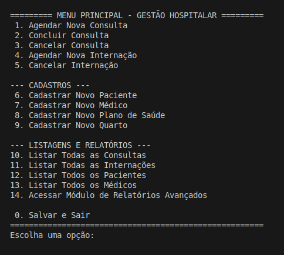
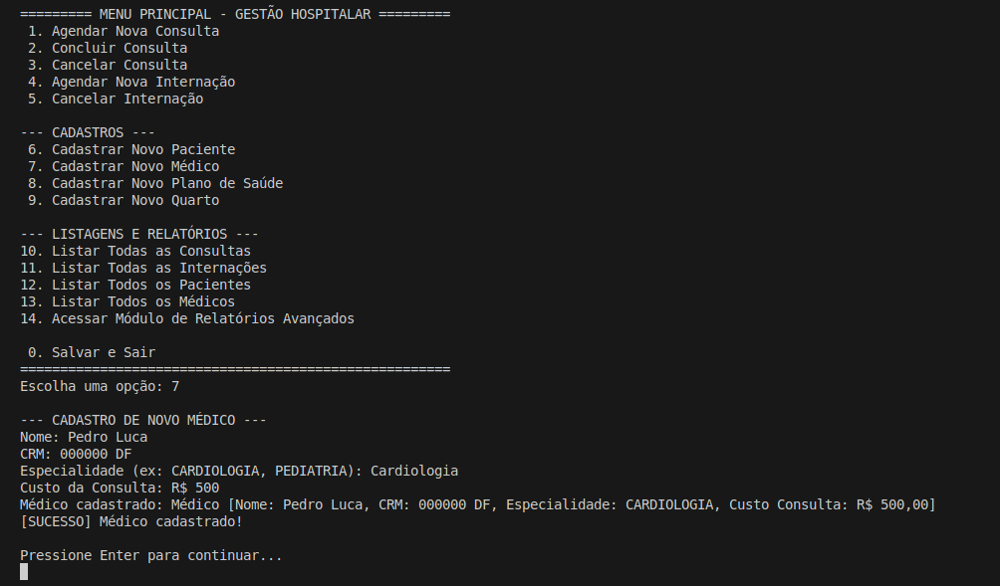
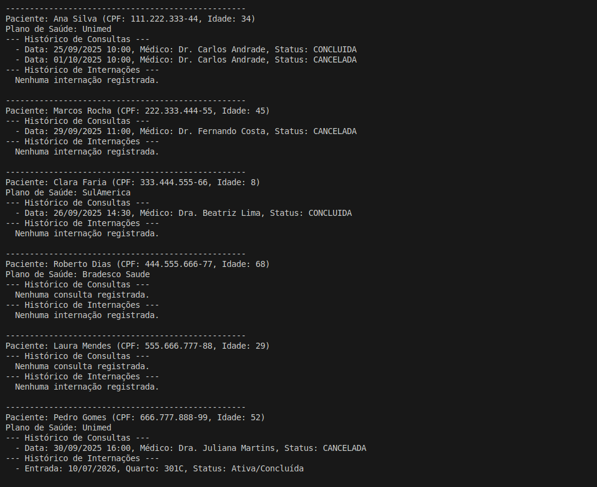

# Trabalho Prático – Sistema de Gerenciamento Hospitalar  
---
## Descrição do Projeto
Este projeto é o Trabalho 1 da disciplina de Orientação a Objetos,  da Universidade de Brasília (UnB FCTE). Consiste no desenvolvimento, em Java, de um sistema de gerenciamento hospitalar que aplica os conceitos de herança, polimorfismo e encapsulamento, com persistência de dados em arquivos no formato CSV.

## Dados do Aluno

- **Nome completo:** Pedro Luca Rocha Manera
- **Matrícula:** 242004958
- **Curso:** Engenharias

---

## Instruções para Compilação e Execução

1. **Compilação:**  
   Para compilar o projeto, execute o comando abaixo a partir da pasta raiz (`EP1-2025.2-PedroManera`):

   ```bash
   javac -d bin $(find src -name "*.java")

2. **Execução:**  
   ```bash
   java -cp bin main.App

3. **Estrutura de Pastas:**  
```
   EP1-2025.2-PedroManera/
   │
   ├── .vscode/
   ├── bin/
   ├── lib/
   ├── prints/
   │
   ├── src/
   │   ├── entidades/
   │   │   ├── Consulta.java
   │   │   ├── Especialidade.java
   │   │   ├── Internacao.java
   │   │   ├── Medico.java
   │   │   ├── Paciente.java
   │   │   ├── PacienteEspecial.java
   │   │   ├── Pessoa.java
   │   │   ├── PlanoSaude.java
   │   │   ├── Quarto.java
   │   │   ├── StatusConsulta.java
   │   │   └── TipoQuarto.java
   │   │
   │   ├── main/
   │   │   └── App.java
   │   │
   │   ├── persistencia/
   │   │   └── ArquivoService.java
   │   │
   │   ├── services/
   │   │   ├── ConsultaService.java
   │   │   ├── HospitalService.java
   │   │   ├── InternacaoService.java
   │   │   ├── MedicoService.java
   │   │   ├── PacienteService.java
   │   │   ├── PlanoSaudeService.java
   │   │   ├── QuartoService.java
   │   │   └── RelatorioService.java
   │   │
   │   └── view/
   │       └── Display.java
   │
   ├── .gitignore
```

3. **Versão do JAVA utilizada:**  
   java 24.0.2

---

## Vídeo de Demonstração

- [Link para o vídeo testando o sistema e suas funções principais](https://drive.google.com/file/d/1caVS0wMFAGDC9ZAnYStP-Bk7awEuMtmc/view?usp=sharing)
---

## Prints da Execução

1. Menu Principal:  
   

2. Cadastro de Médico:  
   

3. Relatório de Pacientes:  
   

---

---

## Observações (Extras ou Dificuldades)

- Desenvolver este projeto foi um grande aprendizado para mim, principalmente porque minha experiência anterior era mais com linguagens de tipagem dinâmica, como Python. Passar para o Java, que é totalmente orientado a objetos e com tipagem estática, foi complicado no começo. Ter que definir os tipos de dados em todos os momentos me fez quebrar a cabeça com os erros no ínicio. Além disso, implementar a lógica de persistência dos dados em arquivos CSV foi uma parte complicada, porque precisei criar manualmente toda a lógica para garantir que os dados ficassem consistentes, o que no Python era feito muito facilmente pelo Pandas.

---

## Contato

- E-mail: p.lucarocha@gmail.com

---
